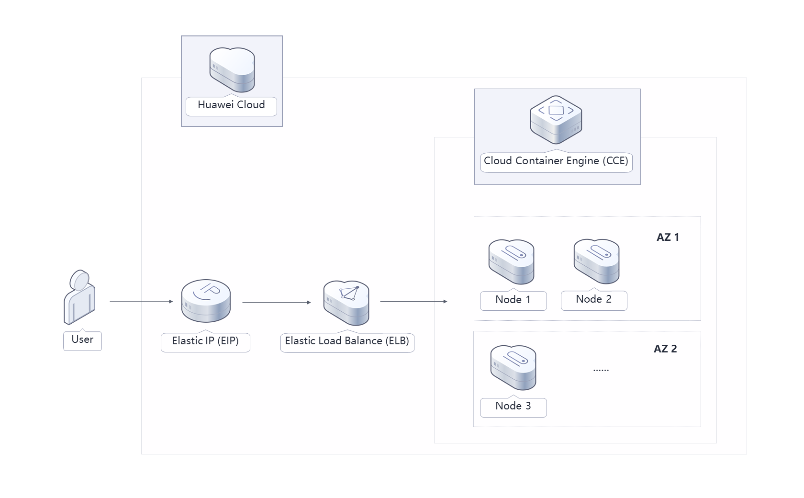
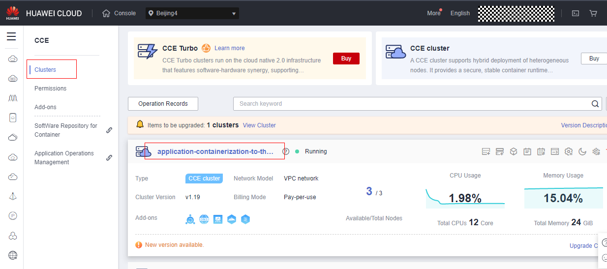
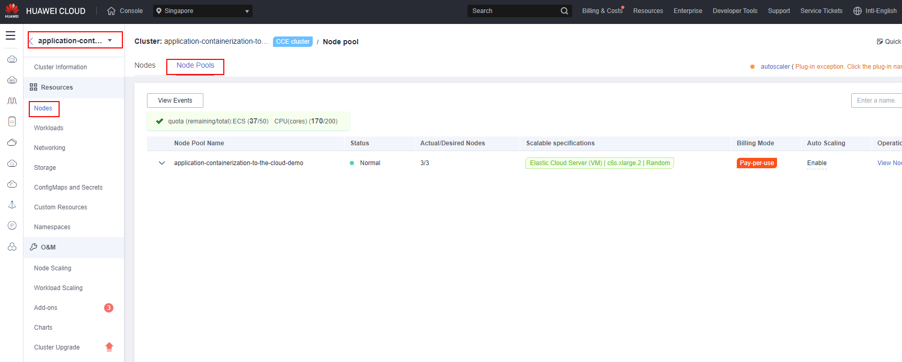
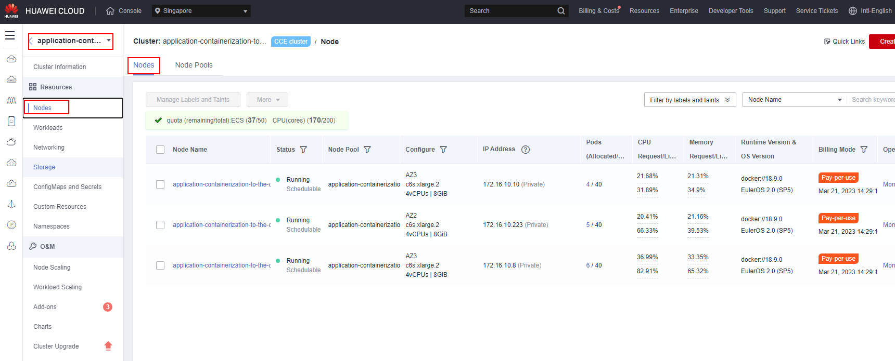
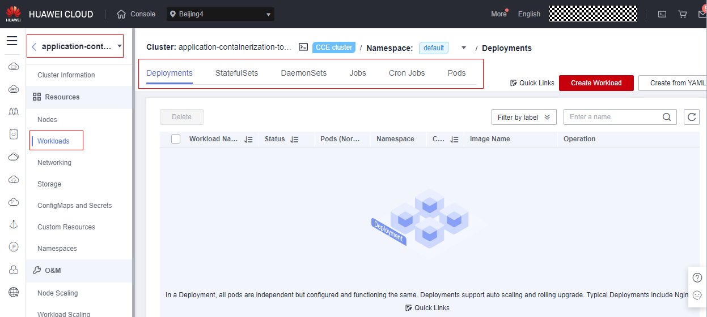

\[TOC]

# **Solution Overview**

This solution is built on Cloud Container Engine (CCE) to quickly deploy a cross-AZ HA container cluster environment, helping you quickly containerize your service systems. CCE is a high-performance, highly reliable service through which enterprises can easily manage containerized applications. It supports native applications and tools of the Kubernetes community.

## **Architecture**



## **Architecture Description**

This solution will:

- Deploy master nodes of a CCE cluster across AZs to manage compute nodes and manage and schedule resources of service systems.
- Create a node pool for a CCE cluster to quickly create, manage, and destroy nodes without affecting the entire cluster.
- Contain three compute nodes in a node pool to run service systems. Compute nodes are deployed across AZs. Each node contains basic components required for running pods. You can add nodes as needed.
- Automatically install common add-ons, such as autoscaler, metrics-server, and cce-hpa-controller, to support scale-out that meets feature requirements.

## **File Structure**

```lua
huaweicloud-solution-application-containerization-to-the-cloud
├── application-containerization-to-the-cloud.tf.json -- Resource orchestration template
```

## **Getting Started**

1. Log in to the [Huawei Cloud CCE console](https://console-intl.huaweicloud.com/cce2.0/?agencyId=WOmAijZnbElNjCFzTVDl4aJQAgdaTUMD&region=ap-southeast-3&locale=en-us#/cce/cluster/list), select your region, and choose **Cloud Container Engine (CCE)** in **Service List**. On the displayed page, choose **Clusters** in the navigation pane. You can see the CCE cluster created using this solution.

	Figure 1 CCE cluster
	

2. On the CCE console, choose **Resources** > **Nodes** > **Node Pools** to view the node pool created using this solution.

	Figure 2 Node pools
	

3. On the CCE console, choose **Resources** > **Nodes** > **Nodes** to view the cluster node created using this solution.

	Figure 3 Nodes
	

4. On the Huawei Cloud CCE console, choose **Workloads** in the navigation pane. Click **Create Workload** in the upper right corner to add a workload. When adding a container, you can select a private or public image to deploy your applications on CCE.

	Figure 4 Workloads
	